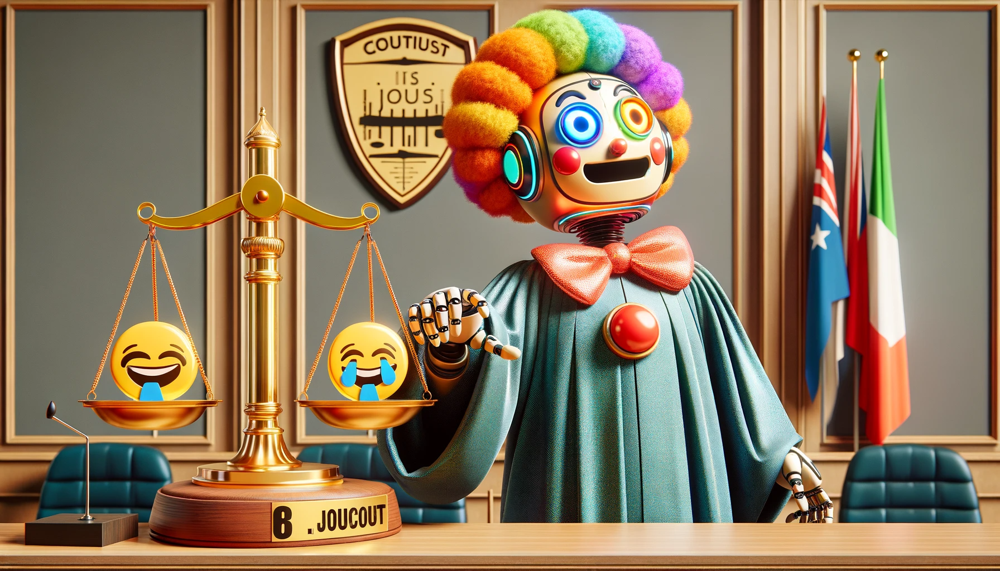

    

# Can a machine judge the quality of a joke?
This the question that I am trying to answer and for the start, I need to to find a way to quantify a good joke. In this repository I will try to analyze the r/jokes subreddit dataset that was uploaded to The dataset that I used is extracted and simplified from [Kaggle](https://www.kaggle.com/datasets/bwandowando/reddit-rjokes-dataset) dataset. This dataset contains ~37200 joke threads.
I chose subset of columns that I was interested in my analysis.
Here are the list of columns that I kept:
- *thread_id*: unique id of the thread containing the joke (Object)
- *thread_title*: title of the thread (Object) *sometimes this title contains start of the joke*
- *thread_selftext*: Text of the thread which includes the joke (Object)
- *thread_score*: This score between 0 and 1 (Object) *supposed to be Upvotes - downvotes but I can't see any negative values so still I don't know what is it.*
- *thread_num_comments*: Number of comments in the thread (float64)
- *thread_created_utc*: Time of the thread creation in UTC (Object)
- *thread_upvote_ratio*: Ratio of upvotes to to total votes (float64)
- *thread_over_18*: Whether the thread is over 18 or not (Object)
 and try to find a way to quantify a good joke. I will also try to build a model that can generate jokes.

 ## Data 
Three files are in the *data* folder
1) **reddit_jokes_slim.csv**: All ~37200 jokes
2) **reddit_jokes_slim_processed.csv**: All jokes but columns are converted to appropriate types
3) **reddit_jokes_slim_clean.csv** : Only clean jokes
4) **reddit_jokes_slim_plus18.csv**: Only adult jokes

## Experiments Notebooks
1) **reddit_jokes_score_analysis.ipynb** : 

Which measure in this dataset can be reflect the quality of the joke? thread_score which is assigned by reddit or thread_upvote_ratio which is the ratio of upvotes to total votes?

2) **reddit_jokes_adult_logreg_classifier.ipynb**:

Not directly related to the quality of the joke but my curiosity. I trained a simple logistic regression model to classify adult jokes. I used thread_title, thread_selftext as features and thread_over_18 as target. Good performance considering how simple the model is. Of course, more objective test of the model, I need to find a much larger dataset.

3) **reddit_jokes_adult_lstm_classifier.ipynb**:

Another attempt to detect adult jokes. This time I used LSTM model which resulted in better performance compare to logistic regression model.

4) **reddit_jokes_upvote_prediction_linreg_1.ipynb**:
In this notebook we try to predict the thread_upvote_ratio using thread_title and thread_selftext. We used linear regression model and we got -0.06 R2 score which is not is not adequate. Also, We explore the performance of this model using Q-Q plot of the residues as well as residue plot. All the plots indicates the poor performance of the model.